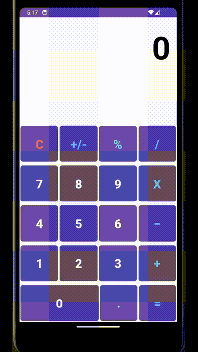

# Calculator App(XML)

A basic and minimalistic calculator app with Addition, Subtraction, 
Multiplication, Division and Percentage functionalities.
This app uses XML to define the UI Layout.
The guidlines have been followed accordingly:
- The top is a textview and occupies twice the space as the other rows (in terms of height).
- Top textview has textAlignment set to “textEnd”, textSize as 80sp, and textStyle is “bold”
- The “0” button occupies twice the space as other buttons (in terms of width).
- Every component has a margin of 2dp and a text size of 30 sp (except the top textView).

## Functionality

The following **required** functionality is completed:

* [ ] User sees a basic calculator with +, -, x, /, operators
* [ ] User can perform the mentioned operations.
* [ ] User can clear the display with 'C'.
* [ ] User can add decimal point.
* [ ] User can perform percentage operation.

## Video Walkthrough

Here's a walkthrough of implemented user stories:

## Notes

Describe any challenges encountered while building the app.

The only challenge I faced was adjusting the shape of buttons which was originally round. 
I used a drawable resource to deal with this. I couldn't use ConstraintLayout for the same
because I was following a TableLayout.

## License

    Copyright [2024] [Tanmayee Tajane]

    Licensed under the Apache License, Version 2.0 (the "License");
    you may not use this file except in compliance with the License.
    You may obtain a copy of the License at

        http://www.apache.org/licenses/LICENSE-2.0

    Unless required by applicable law or agreed to in writing, software
    distributed under the License is distributed on an "AS IS" BASIS,
    WITHOUT WARRANTIES OR CONDITIONS OF ANY KIND, either express or implied.
    See the License for the specific language governing permissions and
    limitations under the License.
